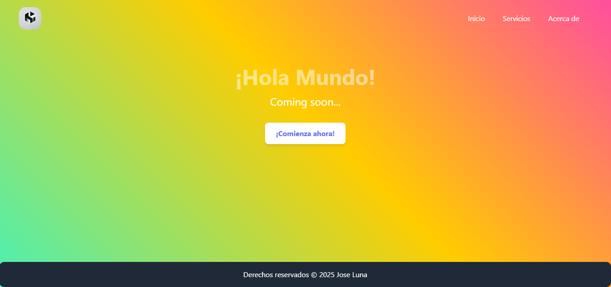

# 🌟 Mi Proyecto en React  

Este es un proyecto desarrollado con **React** utilizando `Create React App`. Incluye animaciones con `Framer Motion`, navegación con `React Router` y un fondo dinámico.  

## 🚀 Características  
👉 **React Router:** Navegación fluida entre páginas.  
👉 **Framer Motion:** Animaciones suaves y transiciones dinámicas.  
👉 **Fondo Animado:** Un degradado de colores en movimiento continuo.  
👉 **Diseño Responsivo:** Adaptado para dispositivos móviles y escritorio.  

## 📦 Instalación  
Para clonar y ejecutar este proyecto en tu máquina local:  
```bash  
git clone https://github.com/lunajose0/React-web.git  
cd tu-repositorio  
npm install  
```

## ▶️ Uso  
Ejecuta el siguiente comando para iniciar la aplicación en modo desarrollo:  
```bash  
npm start  
```
Luego, abre [http://localhost:3000](http://localhost:3000) en tu navegador.  

## 🛠️ Scripts Disponibles  
- `npm start` → Ejecuta la aplicación en modo desarrollo.  
- `npm test` → Inicia el modo interactivo de pruebas.  
- `npm run build` → Compila la aplicación para producción en la carpeta `build`.  
- `npm run eject` → Extrae la configuración predeterminada de Create React App. (⚠️ Acción irreversible)  

## 📸 Capturas  
  

## 🌐 Tecnologías Utilizadas  
- React  
- React Router  
- Framer Motion  
- Tailwind CSS  
- JavaScript (ES6+)  


## 📞 Contacto  
Si tienes preguntas o sugerencias, puedes contactarme en:  
📧 **[josejavier.farias@gmail.com](mailto:josejavier.farias@gmail.com)**  
🐙 **GitHub:** [https://github.com/lunajose0](https://github.com/lunajose0)  

